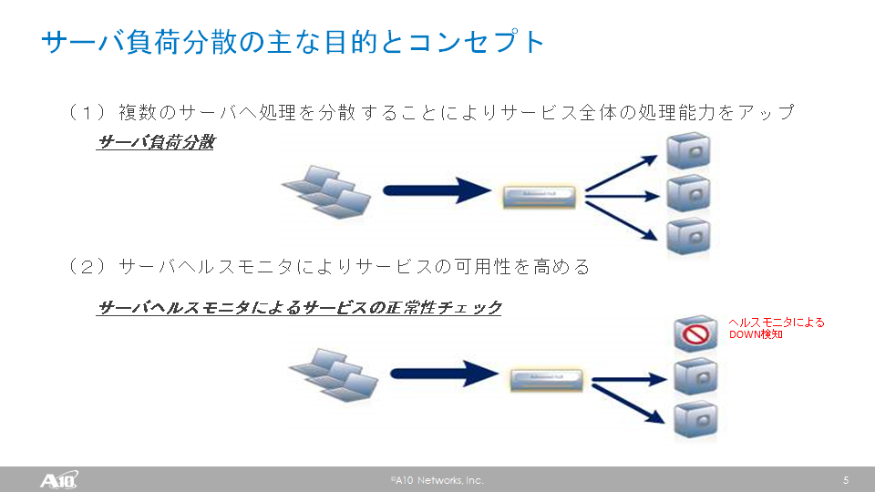
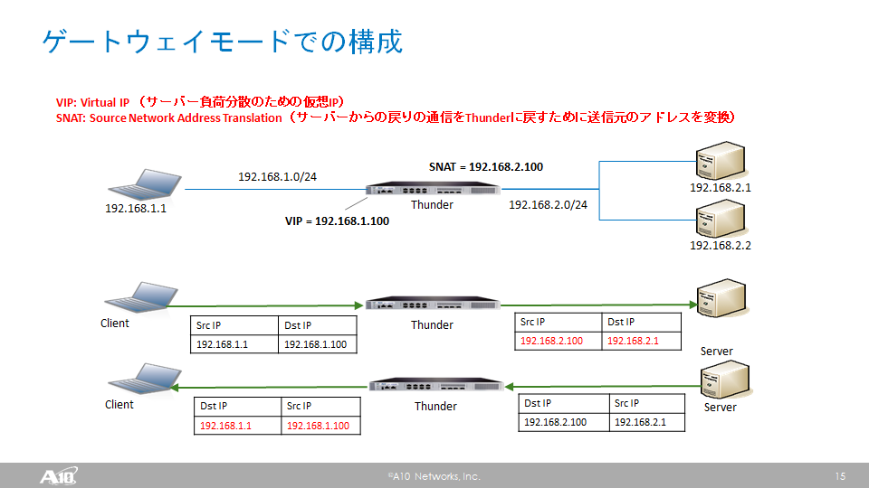

# 演習 1.0 - サーバ負荷分散の基礎と演習環境の確認

#### A10 Thunder用Ansibleモジュールについて

A10 Thunder用のAnsibleモジュールは、以下のGitHubにあります。
ほぼ全ての機能の構成管理に対応する1,400以上のモジュールが用意されています。
[Click here to A10 Ansible Modules on GitHub](https://github.com/a10networks/a10-ansible)

このAnsibleモジュールではA10 Thunderの提供するREST APIであるaXAPIを利用しています。
Ansibleモジュールを実行する際は、Ansible Coreが動作しているサーバにSSHし、ローカルでモジュールを実行することで、aXAPIを通じた構成変更が行われます。

このトレーニングではこのAnsibleモジュールの一部を利用して、A10 vThunderのサーバ負荷分散設定に関わる構成変更を行います。
Ansibleモジュールの実体は、Ansible用CentOSサーバの`/root/a10-ansible/a10_ansible` 以下にあり、このディレクトリ以下で全てのモジュールを確認できます。

#### サーバ負荷分散の基礎

ADC（Application Delivery Controller）のサーバー負荷分散の主な目的は、
-　複数のサーバーへ処理を分散することでサービス全体の処理性能をアップする
-　サーバヘルスモニタによりサービスの可用性を高める
の2点があります。



ADCはネットワークスイッチよりも上位のレイヤ4（トランスポート層）からレイヤ7（アプリケーション層）で、主にセッションベースで動作します。

ADCは負荷分散するサービスに応じてさまざまな構成での導入が可能ですが、このトレーニングでは、ゲートウェイモードでの構成を行います。
この構成では、クライアントはA10 Thunder ADCの仮想IP（Virtual IP；VIP）にアクセスし、送信元IPが変換されてサーバーに転送されます。
負荷分散の方式に応じてThunder ADCが2台のサーバーにトラフィックを分散します。
ヘルスモニターの結果、もしサーバーが動作していなければ、トラフィックを転送しません。
サーバーは変換された送信元IPに対してレスポンスを返し、Thunderでトラフィックを受信します。
Thunderはレスポンストラフィックの宛先を元のクライアントのIPに変換し、送信元IPもVIPに変換してトラフィックを返送します。



この構成を行うために、Thunder ADCでは以下のような設定を行います。
負荷分散の対象となるサーバーのIPアドレスとポート番号（ここではHTTPの80番）を設定し、これを複数まとめてService Groupというものを構成します。
Service Groupの中で負荷分散の方式を設定します（ここでは到着順に順番にトラフィックを割り振るRound Robin方式を採用しています）。
クライアントからのトラフィックを受信するVirtual ServerとIPアドレス、および受信ポートを設定し、受信ポートにService Groupを紐づけます。
また、別途SNAT用のIPアドレスプールの設定を行い、これも受信ポートに設定を紐づけます。
こうすることで、Virtual ServerのIPアドレスの80番ポートに来たHTTPトラフィックは、SNATされてサーバーに負荷分散されます。


#### 演習環境について


本演習での演習環境は上記のようになっています。
クライアント用のサーバーとして、Windows 10のサーバーとCentOSのサーバーの2台、仮想版のThunderであるvThunderを1台、サーバー負荷分散の対象となるWebサーバー（CentOSサーバ）を2台用意しています。
上記に加え、Ansibleの動作用にCentOSのサーバーを1台用意しています。
Window 10サーバーにはRemote Desktopで、Ansible動作用のCentOSサーバーにはSSH経由で外部からのアクセスが可能です。
上図中に示されているIPアドレスにアクセスすることで、管理用ポートからのログインが可能です。
クライアント用のサーバーとvThunderのethernet 1は192.168.1.0/24のネットワークセグメントに接続されており、vThunderのethernet 2とWebサーバーは192.168.2.0/24のネットワークセグメントに接続されています。
本演習では、簡単のために全ての操作をroot/admin権限で実施します。

#### Windows 10へのリモートデスクトップ接続

まず、演習環境のWindows 10クライアントへリモートデスクトップ接続します。
リモートデスクトップ接続用のドメイン名とIPアドレスについては、演習担当から別途通知されますのでそちらをご利用ください。

#### vThunderの構成確認

リモートデスクトップでWindows 10クライアントにログインできたら、Teratermなどを使ってvThunderにログインします。
vThunderの管理用IPアドレスにSSHで接続し、ユーザ名とパスワードを入力してください。
ThunderのCLIには、Execモード、Enableモード、Configモードの3種類のモードがあります。


CLIにログイン後、以下のように`enable`コマンドを実行するとEnableモードになります。Passwordは設定されていません。
Enableモードに入ると、プロンプトが`#`に変わります。
ここで、`show running-config`コマンドを実行すると、現在の設定を確認できます。
最初の段階では、主に管理ポート用の設定だけが入っていることがわかります。
```
vThunder> enable
Password:
vThunder# show running-config
!Current configuration: 251 bytes
!Configuration last updated at 15:15:52 IST Wed Sep 11 2019
!Configuration last saved at 15:16:31 IST Wed Sep 11 2019
!64-bit Advanced Core OS (ACOS) version 4.1.4-GR1, build 78 (Jan-18-2019,16:02)
!
multi-config enable
!
terminal idle-timeout 0
!
interface management
  ip address 10.255.0.1 255.255.0.0
  ip default-gateway 10.255.255.1
!
interface ethernet 1
!
interface ethernet 2
!
!
sflow setting local-collection
!
sflow collector ip 127.0.0.1 6343
!
!
end
!Current config commit point for partition 0 is 0 & config mode is classical-mode
vThunder#
```

EnableモードからExecモードに戻る場合や、Thunderからログオフする際は、`exit`コマンドを実行します。
```
vThunder# exit
vThunder> exit
```


#### Ansible実行サーバの環境確認

Windows 10クライアントから、またはインターネット経由でAnsible実行サーバにSSHでrootとしてログインします。
ログインすると、以下のディレクトリがあることを確認できます。
- a10-ansible： A10用のAnsible Moduleが格納されています
- example_certs: 応用演習に関するTLS証明書と秘密鍵のサンプルが格納されています
- example_playbook: 本演習に関するAnsible Playbookのサンプルが格納されています


### Ansible実行サーバ上での初期設定

Ansible実行サーバ上で実習用のplaybookを格納するディレクトリを作成し、そのディレクトリに移動します。
```
[root@Ansible]$ mkdir playbook
[root@Ansible]$ cd playbook
```

ディレクトリ内にAnsibleのインベントリを示すためのファイル`hosts`を作成します。
```
[root@Ansible]$ vi hosts
```

`hosts`に以下の内容を記述し保存します。
```
[all:vars]
a10_username=admin
a10_password=a10
a10_port=443

[vThunder]
10.255.0.1
```
`[all:vars]`にPlaybook全般で利用する以下の変数を記述しています。
- a10_username: vThunderのaXAPIにアクセスするためのユーザー名
- a10_password: vThunderのaXAPIにアクセスするためのパスワード
-　a10_port: vThunderのaXAPIにアクセスするポート番号

`[vThunder]`にはPlaybookで操作対象にするThunder（本演習では1台のみ）のIPアドレスを記述しています。

本演習は以上となります。  [Click here to return to the training guide](../README.ja.md)
