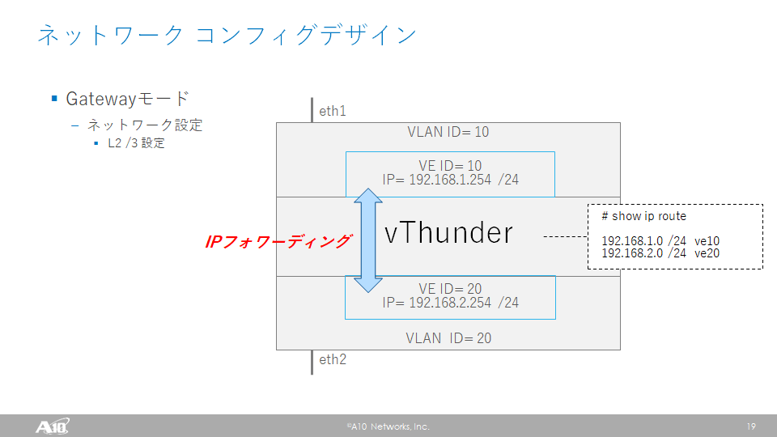

# 演習 1.1 - VLANの設定とデータポートの割り当て

## 目次

- [本演習の目的](#本演習の目的)
- [VLANを構成するPlaybookの作成](#VLANを構成するPlaybookの作成)
- [VLANを構成するPlaybookの実行](#VLANを構成するPlaybookの実行)
- [VLANを削除するPlaybookの作成と実行](#VLANを削除するPlaybookの作成と実行)
- [複数のVLANを構成するPlaybookの作成と実行](#複数のVLANを構成するPlaybookの作成と実行)
- [構成を保存するPlaybookの作成](#構成を保存するPlaybookの作成)
- [構成を保存するPlaybookの実行](#構成を保存するPlaybookの実行)
- [仮想インターフェースを構成するPlaybookの作成](#仮想インターフェースを構成するPlaybookの作成)
- [仮想インターフェースを構成するPlaybookの実行](#仮想インターフェースを構成するPlaybookの実行)
- [設定可能なパラメーターの確認](#設定可能なパラメーターの確認)

# 本演習の目的

本演習では、`a10_network_vlan`モジュールと`a10_interface_ve_ip`モジュールを利用し、vThunderのネットワーク設定を行います。
Ansibleを用いた構成の追加と削除の方法、冪等性、および`with_items`を用いた複数の設定を同時に行う方法についても学習します。
`a10_write_memory`モジュールによるvThunderの構成情報の保存も行います。

この演習では、vThunderのethernet 1とethernet 2に接続されているネットワークが異なっており、それぞれに対し便宜上VLAN IDの10番と20番を割り振ります。
vThunder内で異なるネットワーク間の通信はフォワーディングされます。



# VLANを構成するPlaybookの作成

Ansible実行用サーバーのplaybookディレクトリで、`a10_network_vlan_create.yaml`という名前でPlaybookを作成します。
エディタはここではviを使っていますが、emacs等を利用しても構いません。

```
[root@ansible playbook]# vi a10_network_vlan_create.yaml
```

まずは、以下のPlaybook定義を記述します。
``` 
---
- hosts: 10.255.0.1
  connection: local
  gather_facts: no
  
```

- ファイルの先頭の`---`は、このファイルが YAML であることを示すための記述になります。
- `hosts: 10.255.0.1`は、このPlaybookがvThunderに対して実行されることを示しています。
- `connection: local`は、このPlaybookがvThunder上ではなくローカルで（Ansible実行サーバー上で）実行されることを示しています。
- `gather_facts: no`は、Fact情報の収集を無効化するためのものです。Playbookがローカルで実行されるため、vThunderのFact情報は収集できません。

次に、Playbook内で利用する変数を`vars`として記述します。必要に応じ、この変数は外部のファイル等に記述することも可能です。

``` 
---
- hosts: 10.255.0.1
  connection: local
  gather_facts: no

  vars:
    a10_host: "10.255.0.1"
  
```

ここでは変数`a10_host`として、vThunderの管理用ポートのIPアドレスを指定しています。

次に、Playbook内で実行する処理を`tasks`として記述します。

``` 
---
- hosts: 10.255.0.1
  connection: local
  gather_facts: no

  vars:
    a10_host: "10.255.0.1"
  tasks:
  - name: Create VLAN
    a10_network_vlan:
      a10_host: "{{ a10_host }}"
      a10_port: "{{ a10_port }}"
      a10_username: "{{ a10_username }}"
      a10_password: "{{ a10_password }}"
      vlan_num: "10"
      untagged_eth_list:
        - untagged_ethernet_start: "1"
          untagged_ethernet_end: "1"
      ve: "10"
      state: present
      partition: shared
  
```

- `name: Create VLAN`は、タスクの説明文で、Playbook実行時にこの内容が表示されます。
- `a10_network_vlan:`は、タスクで使用されるモジュール名を示しています。これはvThunderに対しVLANの設定を行うモジュールです。
- `a10_host: "{{ a10_host }}"`は、モジュールのパラメーターで、モジュールがどのvThunderのIPアドレスに接続するかを指定します。ここでは上記の`vars`で定義された`a10_host`を参照しています。
- `a10_port: "{{ a10_port }}"`は、モジュールのパラメーターで、モジュールが接続するvThunderのポートを指定します。ここではインベントリ（hostsファイル）で定義された`a10_port`を参照しています。
- `a10_username: "{{ a10_username }}"`は、モジュールのパラメーターで、vThunderのaXAPIを実行するユーザー名を指定します。ここではインベントリ（hostsファイル）で定義された`a10_username`を参照しています。
- `a10_password: "{{ a10_password }}"`は、モジュールのパラメーターで、vThunderのaXAPIを実行するユーザーに対応したパスワードを指定します。ここではインベントリ（hostsファイル）で定義された`a10_password`を参照しています。
- `vlan_num: "10"`は、モジュールのパラメーターで、`a10_network_vlan`で設定するVLANのID番号を指定します。
- `untagged_eth_list:`は、リスト形式のモジュールのパラメーターで、`a10_network_vlan`で設定するVLANに対応したethernetの番号を、`untagged_ethernet_start`と`untagged_ethernet_end`で開始番号と終了番号を指定して設定します。
- `ve: "10"`は、モジュールのパラメーターで、`a10_network_vlan`で設定するVLANに対応する仮想インターフェースのID番号を指定します。VLANのID番号と同一である必要があります。
- `state: present`は、モジュールのパラメーターで、このタスクで指定された構成がvThunder上に設定されている状態になることを指定するものです。
- `partition: shared`は、モジュールのパラメーターで、このタスクで指定された構成をvThunderのデフォルトの論理パーティション（shared）に対して構成することを示しています。

`a10_host`、`a10_port`、`a10_username`、`a10_password`、`state`、`partition`の6つのパラメーターは、ほぼ全てのA10 Thunder用のAnsibleモジュールに共通で利用するパラメーターとなります。

ここまで記述したところで、Playbookを保存しコマンドラインに戻ります。

# VLANを構成するPlaybookの実行

コマンドラインへ戻ったら、以下のコマンドでPlaybookを実行します。コマンドラインオプションで`-i hosts`を指定し、インベントリファイルを読み込みます。

```
[root@ansible playbook]# ansible-playbook -i hosts a10_network_vlan_create.yaml
```

問題が無ければ、以下の応答が得られます。

```
PLAY [10.255.0.1] *********************************************************************************************************************************

TASK [Create VLAN] ********************************************************************************************************************************
changed: [10.255.0.1]

PLAY RECAP ****************************************************************************************************************************************
10.255.0.1                 : ok=1    changed=1    unreachable=0    failed=0    skipped=0    rescued=0    ignored=0

```

上記は、ホスト`10.255.0.1`に対してTASK`Create VLAN`が実行され、構成が変更されて（changed）、全体としてタスクが1つ成功して（ok=1）構成変更が1回行われた（changed=1）ことを示しています。

vThunderにログインして、実際に構成が変更されているか確認してみましょう。

```
vThunder#show running-config
!Current configuration: 325 bytes
!Configuration last updated at 11:08:41 IST Thu Sep 12 2019
!Configuration last saved at 17:31:02 IST Wed Sep 11 2019
!64-bit Advanced Core OS (ACOS) version 4.1.4-GR1, build 78 (Jan-18-2019,16:02)
!
multi-config enable
!
terminal idle-timeout 0
!
vlan 10
  untagged ethernet 1
  router-interface ve 10
!
interface management
  ip address 10.255.0.1 255.255.0.0
  ip default-gateway 10.255.255.1
!
interface ethernet 1
!
interface ethernet 2
!
interface ve 10
!
!
sflow setting local-collection
!
sflow collector ip 127.0.0.1 6343
!
!
end
!Current config commit point for partition 0 is 0 & config mode is classical-mode
```

新たに、`vlan 10`とネットワークインターフェースの紐づけ、および仮想インターフェース（ve）が構成されていることがわかります。

では、同じPlaybookをAnsible実行用サーバー上で再度実行してみましょう。
```
[root@ansible playbook]# ansible-playbook -i hosts a10_network_vlan_create.yaml

PLAY [10.255.0.1] *********************************************************************************************************************************

TASK [Create VLAN] ********************************************************************************************************************************
ok: [10.255.0.1]

PLAY RECAP ****************************************************************************************************************************************
10.255.0.1                 : ok=1    changed=0    unreachable=0    failed=0    skipped=0    rescued=0    ignored=0

```

先ほどと実行結果が異なり、同じ構成がすでにvThunder上にあることから、構成変更がなく（changed=0）、すでに構成がされていることが確認されます（ok=1）。
このモジュールではこのように冪等性が保たれるため、二重で構成変更されることなく、Playbookに記述した構成の確認を行うことができます。

# VLANを削除するPlaybookの作成と実行

次に、この構成を削除するためのPlaybookを作成します。
作成済みのPlaybook`a10_network_vlan_create.yaml`を`a10_network_vlan_delete.yaml`としてコピーし、編集します。

```
[root@ansible playbook]# cp a10_network_vlan_create.yaml a10_network_vlan_delete.yaml
[root@ansible playbook]# vi a10_network_vlan_delete.yaml
```

Playbookの内容のうち、`state`を`present`から`absent`に書き換えて保存します。

```
---
- hosts: 10.255.0.1
  connection: local
  gather_facts: no

  vars:
    a10_host: "10.255.0.1"
  tasks:
  - name: Delete VLAN
    a10_network_vlan:
      a10_host: "{{ a10_host }}"
      a10_port: "{{ a10_port }}"
      a10_username: "{{ a10_username }}"
      a10_password: "{{ a10_password }}"
      vlan_num: "10"
      untagged_eth_list:
        - untagged_ethernet_start: "1"
          untagged_ethernet_end: "1"
      ve: "10"
      state: absent
      partition: shared
```

このPlaybookを実行してみます。

```
[root@ansible example_playbook]# ansible-playbook -i hosts a10_network_vlan_delete.yaml

PLAY [10.255.0.1] *********************************************************************************************************************************

TASK [Delete VLAN] ********************************************************************************************************************************
changed: [10.255.0.1]

PLAY RECAP ****************************************************************************************************************************************
10.255.0.1                 : ok=1    changed=1    unreachable=0    failed=0    skipped=0    rescued=0    ignored=0

```

該当のVLANの削除が実行され、構成変更が行われたことがわかります。
vThunderの設定を確認してみましょう。

```
vThunder#show running-config
!Current configuration: 251 bytes
!Configuration last updated at 11:24:13 IST Thu Sep 12 2019
!Configuration last saved at 17:31:02 IST Wed Sep 11 2019
!64-bit Advanced Core OS (ACOS) version 4.1.4-GR1, build 78 (Jan-18-2019,16:02)
!
multi-config enable
!
terminal idle-timeout 0
!
interface management
  ip address 10.255.0.1 255.255.0.0
  ip default-gateway 10.255.255.1
!
interface ethernet 1
!
interface ethernet 2
!
!
sflow setting local-collection
!
sflow collector ip 127.0.0.1 6343
!
!
end
!Current config commit point for partition 0 is 0 & config mode is classical-mode
```

VLAN 10の設定がなくなっていることが確認できます。

このように、`state: absent`を指定することで、Playbookに記述した構成が無い状態を実現することができます。

# 複数のVLANを構成するPlaybookの作成と実行

次に、一つのVLANだけでなく複数のVLANの設定をまとめて行うPlaybookを作成します。
作成済みのPlaybook`a10_network_vlan_create.yaml`を`a10_network_vlans_create.yaml`としてコピーし、編集します。

```
[root@ansible playbook]# cp a10_network_vlan_create.yaml a10_network_vlans_create.yaml
[root@ansible playbook]# vi a10_network_vlans_create.yaml
```

Playbookの内容を以下のように書き換えて保存します。

```
---
- hosts: 10.255.0.1
  connection: local
  gather_facts: no

  vars:
    a10_host: "10.255.0.1"
  tasks:
  - name: Create VLAN
    a10_network_vlan:
      a10_host: "{{ a10_host }}"
      a10_port: "{{ a10_port }}"
      a10_username: "{{ a10_username }}"
      a10_password: "{{ a10_password }}"
      vlan_num: "{{ item.vlan_num }}"
      untagged_eth_list:
        - untagged_ethernet_start: "{{ item.untagged_ethernet_start }}"
          untagged_ethernet_end: "{{ item.untagged_ethernet_end }}"
      ve: "{{ item.ve }}"
      state: present
      partition: shared
    with_items:
      - { vlan_num: 10, untagged_ethernet_start: 1, untagged_ethernet_end: 1, ve: 10 }
      - { vlan_num: 20, untagged_ethernet_start: 2, untagged_ethernet_end: 2, ve: 20 }

```

`with_items`を使うことで、一つのタスクの中で複数の変数を代入して繰り返し処理を実行することができます。
この例では、VLAN IDとして10と20を設定し、それぞれにethernet 1と2を割り当て、仮想インターフェース10と20を割り当てています。

このPlaybookを実行すると、以下のようになります。

```
[root@ansible playbook]# ansible-playbook -i hosts a10_network_vlans_create.yaml

PLAY [10.255.0.1] *********************************************************************************************************************************

TASK [Create VLAN] ********************************************************************************************************************************
changed: [10.255.0.1] => (item={'vlan_num': 10, 'untagged_ethernet_start': 1, 'untagged_ethernet_end': 1, 've': 10})
changed: [10.255.0.1] => (item={'vlan_num': 20, 'untagged_ethernet_start': 2, 'untagged_ethernet_end': 2, 've': 20})

PLAY RECAP ****************************************************************************************************************************************
10.255.0.1                 : ok=1    changed=1    unreachable=0    failed=0    skipped=0    rescued=0    ignored=0
```

一つのタスクで2つの構成変更を実施し、構成変更が実行されて無事タスクが完了していることが分かります。
vThunderの設定を確認してみましょう。

```
vThunder#show running-config
!Current configuration: 399 bytes
!Configuration last updated at 11:38:08 IST Thu Sep 12 2019
!Configuration last saved at 17:31:02 IST Wed Sep 11 2019
!64-bit Advanced Core OS (ACOS) version 4.1.4-GR1, build 78 (Jan-18-2019,16:02)
!
multi-config enable
!
terminal idle-timeout 0
!
vlan 10
  untagged ethernet 1
  router-interface ve 10
!
vlan 20
  untagged ethernet 2
  router-interface ve 20
!
interface management
  ip address 10.255.0.1 255.255.0.0
  ip default-gateway 10.255.255.1
!
interface ethernet 1
!
interface ethernet 2
!
interface ve 10
!
interface ve 20
!
!
sflow setting local-collection
!
sflow collector ip 127.0.0.1 6343
!
!
end
!Current config commit point for partition 0 is 0 & config mode is classical-mode
```

VLAN 10と20の設定がどちらも入っていることがわかります。

もう一度同じPlaybookを実行してみます。

```
[root@ansible playbook]# ansible-playbook -i hosts a10_network_vlans_create.yaml

PLAY [10.255.0.1] *********************************************************************************************************************************

TASK [Create VLAN] ********************************************************************************************************************************
ok: [10.255.0.1] => (item={'vlan_num': 10, 'untagged_ethernet_start': 1, 'untagged_ethernet_end': 1, 've': 10})
ok: [10.255.0.1] => (item={'vlan_num': 20, 'untagged_ethernet_start': 2, 'untagged_ethernet_end': 2, 've': 20})

PLAY RECAP ****************************************************************************************************************************************
10.255.0.1                 : ok=1    changed=0    unreachable=0    failed=0    skipped=0    rescued=0    ignored=0

```

こちらでも冪等性が保たれていることがわかります。

# 構成を保存するPlaybookの作成

Thunder上で構成変更を実施した場合、構成変更の結果は即時に反映されますが、構成内容はThunderの記憶領域上に保存されておらず、再起動などした場合には元の構成に戻ってしまいます。
構成変更した結果をThunderの記憶領域上に保存し、次回の起動時にも同じ設定で起動するためには、`a10_write_memory`モジュールを利用して構成変更した結果を保存する必要があります。

vThunder上で以下のコマンドを実行し、起動用の設定（startup-config）を表示してみます。

```
vThunder#show startup-config
!Current configuration: 517 bytes
!Configuration last updated at 17:30:59 IST Wed Sep 11 2019
!Configuration last saved at 17:31:02 IST Wed Sep 11 2019
!64-bit Advanced Core OS (ACOS) version 4.1.4-GR1, build 78 (Jan-18-2019,16:02)
!
multi-config enable
!
terminal idle-timeout 0
!
!
interface management
  ip address 10.255.0.1 255.255.0.0
  ip default-gateway 10.255.255.1
  exit-module
!
interface ethernet 1
  exit-module
!
interface ethernet 2
  exit-module
!
!
sflow setting local-collection
!
sflow collector ip 127.0.0.1 6343
!
!
end
```

上記のように、先ほど構成変更した内容が反映されておらず、このまま再起動するとVLANの設定が無い状態で起動することになります。

では、現在の設定（running-config）を起動用の設定として保存するためのPlaybookを作成しましょう。
Ansible実行用サーバーのplaybookディレクトリで、Playbook`a10_write_memory.yaml`を作成します。

```
[root@ansible playbook]# vi a10_write_memory.yaml
```

Playbookを以下のように記述し保存します。

```
---
- hosts: 10.255.0.1
  connection: local
  gather_facts: no

  vars:
    a10_host: "10.255.0.1"
  tasks:
  - name: Write memory
    a10_write_memory:
      a10_host: "{{ a10_host }}"
      a10_username: "{{ a10_username }}"
      a10_password: "{{ a10_password }}"
      a10_port: "{{ a10_port }}"
      state: present
      partition: all
	  
```

このモジュールを実行する場合は、`state: present`である必要があります。
また、全ての論理パーティションの情報を保存するために、`partition: all`を指定しています。

# 構成を保存するPlaybookの実行

このPlaybookを実行すると、以下のようになります。

```
[root@ansible playbook]# ansible-playbook -i hosts a10_write_memory.yaml

PLAY [10.255.0.1] *********************************************************************************************************************************

TASK [Write memory] *******************************************************************************************************************************
changed: [10.255.0.1]

PLAY RECAP ****************************************************************************************************************************************
10.255.0.1                 : ok=1    changed=1    unreachable=0    failed=0    skipped=0    rescued=0    ignored=0

```

このモジュールを実行した場合は、必ず`changed=1`になります。

vThunder上で再度以下のコマンドを実行し、起動用の設定（startup-config）を表示してみます。

```
vThunder#show startup-config
!Current configuration: 729 bytes
!Configuration last updated at 11:38:08 IST Thu Sep 12 2019
!Configuration last saved at 13:51:40 IST Thu Sep 12 2019
!64-bit Advanced Core OS (ACOS) version 4.1.4-GR1, build 78 (Jan-18-2019,16:02)
!
multi-config enable
!
terminal idle-timeout 0
!
vlan 10
  untagged ethernet 1
  router-interface ve 10
  exit-module
!
vlan 20
  untagged ethernet 2
  router-interface ve 20
  exit-module
!
!
interface management
  ip address 10.255.0.1 255.255.0.0
  ip default-gateway 10.255.255.1
  exit-module
!
interface ethernet 1
  exit-module
!
interface ethernet 2
  exit-module
!
interface ve 10
  exit-module
!
interface ve 20
  exit-module
!
!
sflow setting local-collection
!
sflow collector ip 127.0.0.1 6343
!
!
end
```

実行中の設定が起動用の設定として保存されていることを確認できます。

# 仮想インターフェースを構成するPlaybookの作成

次に、仮想インターフェースにIPアドレスを割り当てるために、Ansible実行用サーバーのplaybookディレクトリで、`a10_interface_ve_ip_create.yaml`という名前でPlaybookを作成します。
このPlaybookでは、Ansibleモジュールとして`a10_interface_ve_ip`を利用します。

```
[root@ansible playbook]# vi a10_interface_ve_ip_create.yaml
```

先ほど複数のVLANの作成を行ったように、複数の仮想インターフェースに対して連続してIPアドレスを割り当てます。
また、構成変更後に構成の保存をするためのタスクを追加して連続実行するようにします。

``` 
---
- hosts: 10.255.0.1
  connection: local
  gather_facts: no

  vars:
    a10_host: "10.255.0.1"
  tasks:
  - name: Add IP to VE
    a10_interface_ve_ip:
      a10_host: "{{ a10_host }}"
      a10_port: "{{ a10_port }}"
      a10_username: "{{ a10_username }}"
      a10_password: "{{ a10_password }}"
      ve_ifnum: "{{ item.ve_ifnum }}"
      address_list:
        - ipv4_address: "{{ item.ipv4_address }}"
          ipv4_netmask: "{{ item.ipv4_netmask }}"
      state: present
      partition: shared
    with_items:
      - { ve_ifnum: "10", ipv4_address: 192.168.1.254, ipv4_netmask: 255.255.255.0 }
      - { ve_ifnum: "20", ipv4_address: 192.168.2.254, ipv4_netmask: 255.255.255.0 }

  - name: Write memory
    a10_write_memory:
      a10_host: "{{ a10_host }}"
      a10_username: "{{ a10_username }}"
      a10_password: "{{ a10_password }}"
      a10_port: "{{ a10_port }}"
      state: present
      partition: all
  
```

- `ve_ifnum: "{{ item.ve_ifnum }}"`は、モジュールのパラメーターで、`a10_interface_ve_ip`で設定する仮想インターフェース（VE）のID番号を指定します。
- `address_list:`は、リスト形式のモジュールのパラメーターで、`a10_interface_ve_ip`で設定する仮想インターフェースに設定するIPアドレスを`ipv4_address`、そのnetmaskを`ipv4_netmask`で指定します。

複数のタスクを連続して実行する場合は、`tasks:`以下に複数のタスクを記述します。

ここまで記述したところで、Playbookを保存しコマンドラインに戻ります。

# 仮想インターフェースを構成するPlaybookの実行

このPlaybookを実行すると、以下のようになります。

```
[root@ansible playbook]# ansible-playbook -i hosts a10_interface_ve_ip_create.yaml

PLAY [10.255.0.1] *********************************************************************************************************************************

TASK [Add IP to VE] *******************************************************************************************************************************
changed: [10.255.0.1] => (item={'ve_ifnum': '10', 'ipv4_address': '192.168.1.254', 'ipv4_netmask': '255.255.255.0'})
changed: [10.255.0.1] => (item={'ve_ifnum': '20', 'ipv4_address': '192.168.2.254', 'ipv4_netmask': '255.255.255.0'})

TASK [Write memory] *******************************************************************************************************************************
changed: [10.255.0.1]

PLAY RECAP ****************************************************************************************************************************************
10.255.0.1                 : ok=2    changed=2    unreachable=0    failed=0    skipped=0    rescued=0    ignored=0

```

2つのタスクが連続実行され、1つ目のタスク（Add IP to VE）で仮想インターフェース10と20にIPアドレスが設定され、2つ目のタスク（Write memory）で変更した構成が起動用の設定として保存されたことがわかります。

vThunderの設定を確認してみましょう。

```
vThunder#show running-config
!Current configuration: 365 bytes
!Configuration last updated at 14:07:47 IST Thu Sep 12 2019
!Configuration last saved at 14:07:50 IST Thu Sep 12 2019
!64-bit Advanced Core OS (ACOS) version 4.1.4-GR1, build 78 (Jan-18-2019,16:02)
!
multi-config enable
!
terminal idle-timeout 0
!
vlan 10
  untagged ethernet 1
  router-interface ve 10
!
vlan 20
  untagged ethernet 2
  router-interface ve 20
!
interface management
  ip address 10.255.0.1 255.255.0.0
  ip default-gateway 10.255.255.1
!
interface ethernet 1
!
interface ethernet 2
!
interface ve 10
  ip address 192.168.1.254 255.255.255.0
!
interface ve 20
  ip address 192.168.2.254 255.255.255.0
!
!
sflow setting local-collection
!
sflow collector ip 127.0.0.1 6343
!
!
end
!Current config commit point for partition 0 is 0 & config mode is classical-mode
```

仮想インターフェース（VE）の10と20にIPアドレスが設定されています。

再度同じPlaybookを実行してみます。
```
[root@ansible playbook]# ansible-playbook -i hosts a10_interface_ve_ip_create.yaml

PLAY [10.255.0.1] *********************************************************************************************************************************

TASK [Add IP to VE] *******************************************************************************************************************************
ok: [10.255.0.1] => (item={'ve_ifnum': '10', 'ipv4_address': '192.168.1.254', 'ipv4_netmask': '255.255.255.0'})
ok: [10.255.0.1] => (item={'ve_ifnum': '20', 'ipv4_address': '192.168.2.254', 'ipv4_netmask': '255.255.255.0'})

TASK [Write memory] *******************************************************************************************************************************
changed: [10.255.0.1]

PLAY RECAP ****************************************************************************************************************************************
10.255.0.1                 : ok=2    changed=1    unreachable=0    failed=0    skipped=0    rescued=0    ignored=0

```

仮想インターフェースへのIPアドレス設定の部分は冪等性が保たれていることがわかります。

# 設定可能なパラメーターの確認

これで、VLANの設定とデータポートの割り当てが完了しました。
次の演習では、データポートをenableしてクライアントとの疎通を確認します。

Ansibleモジュールで設定可能なパラメーターを確認したい場合は、以下の`ansible-doc`コマンドで確認できます。
```
[root@ansible playbook]# ansible-doc a10_network_vlan
```

本演習は以上となります。  [トレーニングガイドに戻る](../README.ja.md)
