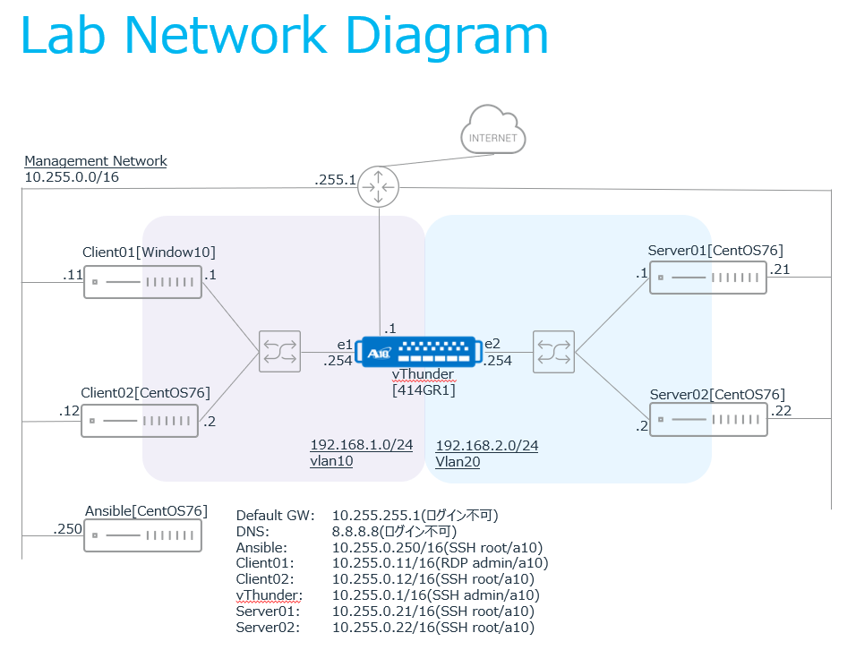

# Ansible Training - A10 Thunder ADC Workshop

このドキュメントはA10 Thunder/vThunder　ADCの構成管理をAnsibleで自動化するためのハンズオントレーニングの内容を示しています。

## 演習環境

演習環境は上記のようになっており、以下から構成されます。
- クライアント用Window 10 （Client01）
- クライアント用CentOS （Client02）
- Ansible実行用CentOS （Ansible）
- vThunder （vThunder）
- WebサーバCentOS （Server01）
- WebサーバCentOS （Server02）
同様の環境を自身の検証環境に構成することで、この演習を同じように実施することも可能です。

## Section 1 - A10 Thunder ADCのAnsibleによる自動構成　基本演習（ネットワーク設定とHTTP仮想サーバの構築）

 - [演習 1.0 - サーバ負荷分散の基礎と演習環境の確認](1.0-adc-primer/README.ja.md)
 - [演習 1.1 - VLANの設定とデータポートの割り当て](1.1-vlan-configuration/README.ja.md)
 - [演習 1.2 - データポートのenable](1.2-enable-dataport/README.ja.md)
 - [演習 1.3 - Real serverの追加](1.3-real-server-configuration/README.ja.md)
 - [演習 1.4 - Service Groupの構成](1.4-service-group-configuration/README.ja.md)
 - [演習 1.5 - NATプールの設定](1.5-nat-pool-configuration/README.ja.md)
 - [演習 1.6 - HTTPのVirtual Serverの構成](1.6-http-virtual-server-configuration/README.ja.md)
 - [演習 1.7 - Real Serverの切り離しと切り戻し](1.7-disable-real-server/README.ja.md)

## Section 2 - A10 Thunder ADCのAnsibleによる自動構成　応用演習（HTTPS仮想サーバの構築）

 - [演習 2.0 - 自己証明書の作成とThunderへのインポート](2.0-import-certs/README.ja.md)
 - [演習 2.1 - SSL/TLSテンプレートの作成](2.1-ssl-template-configuration/README.ja.md)
 - [演習 2.2 - HTTPSのVirtual Serverの構成](2.2-https-virtual-server-configuration/README.ja.md)

---
